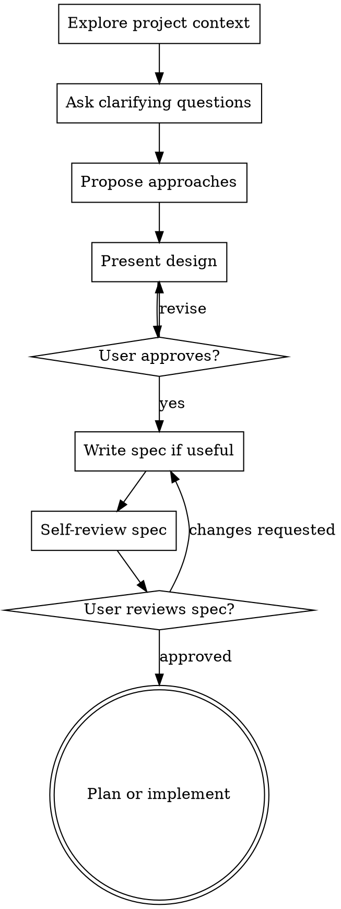

# Brainstorming Ideas Into Designs

Turn a rough idea into a clear design/spec through collaborative dialogue before implementation.

This skill is adapted for Codex. It should guide the conversation, not block normal coding work when the user has already given clear implementation requirements.

## When To Use

Use this skill when:

- The user says `$brainstorming`, "brainstorm", "先设计", "出方案", "写需求/规格", or similar.
- The request is a substantial new feature, UI, workflow, product behavior, or architecture change and important requirements are still unclear.
- Multiple implementation approaches are plausible and the user needs trade-offs before code.

Do not use this skill for:

- Small bug fixes or mechanical edits with clear expected behavior.
- Code review, explanation, formatting, or test-only requests.
- Direct implementation requests where the user already supplied enough detail and explicitly wants code now.

## Core Rule

Do not start implementation for a brainstorming-scoped task until you have presented a design and the user has approved it.

For very small ideas, the design may be a short paragraph. For larger work, use sections and ask for approval after each section.

## Checklist

Complete these steps in order, skipping only when a step is clearly not relevant:

1. **Explore project context** - inspect files, docs, relevant code, and recent changes before proposing.
2. **Offer the visual companion just-in-time** - only when a visual mockup/diagram would genuinely be clearer than text. See "Visual Companion".
3. **Ask clarifying questions** - one question at a time; prefer multiple choice when useful.
4. **Propose 2-3 approaches** - include trade-offs and a recommendation.
5. **Present the design** - cover architecture, components, data flow, error handling, and testing at a level appropriate to scope.
6. **Write the design doc when useful** - default path: `docs/specs/YYYY-MM-DD-<topic>-design.md`, unless the user prefers another path.
7. **Review the spec** - check for placeholders, contradictions, ambiguity, and scope creep; fix issues inline.
8. **Ask the user to review** - wait for approval before moving into an implementation plan or code.
9. **Transition to planning or implementation** - if a planning skill is available and appropriate, use it; otherwise write the implementation plan directly in the conversation.

Do not commit the design doc unless the user explicitly asks you to commit.

## Process Flow

## Understanding The Idea

- Inspect the current project state first. Read relevant source files, docs, and recent git changes.
- If the request contains multiple independent subsystems, flag that early and help decompose it. Brainstorm the first sub-project through the normal flow.
- Ask one clarifying question per message.
- Focus on purpose, constraints, users, data, success criteria, and failure handling.
- If the user wants to skip design, honor that only after confirming the risk in one concise sentence.

## Exploring Approaches

- Propose 2-3 viable approaches.
- Lead with the recommended option and explain why.
- Include practical trade-offs: complexity, migration risk, testability, performance, maintainability, and user impact.
- Avoid unrelated refactors. Include targeted cleanup only when it directly supports the current goal.

## Presenting The Design

Scale detail to the work:

- **Small change:** a concise design paragraph plus test/verification notes.
- **Medium feature:** sections for behavior, API/data changes, integration points, error handling, and tests.
- **Large feature:** decompose into sub-projects, then design one part at a time.

For existing codebases, follow existing patterns and naming. Identify any local design constraints discovered during context review.

## Design For Isolation And Clarity

Break the work into units with clear responsibilities and interfaces. For each unit, be able to answer:

- What does it do?
- How is it used?
- What does it depend on?
- How is it tested?

If a proposed unit cannot be understood without reading its internals, tighten the boundary before moving on.

## After The Design

When a written spec is warranted:

- Save it to `docs/specs/YYYY-MM-DD-<topic>-design.md` unless the user requests a different path.
- Keep the spec focused on decisions needed for implementation.
- Do not add process notes, unresolved placeholders, or speculative features.
- Do not commit unless explicitly requested.

### Spec Self-Review

Before asking the user to review the spec, check:

1. **Placeholders:** remove or resolve `TBD`, `TODO`, and incomplete sections.
2. **Consistency:** ensure behavior, architecture, data flow, and tests agree.
3. **Scope:** confirm the spec is focused enough for one implementation plan.
4. **Ambiguity:** make requirements explicit when they could be interpreted more than one way.
5. **YAGNI:** remove features that are not needed for the stated goal.

If independent review tooling or subagents are available, you may use `spec-document-reviewer-prompt.md` as a review template. Otherwise, perform the review yourself.

Suggested user review message:

> "Spec written to `<path>`. Please review it and tell me what you want changed before we move into the implementation plan."

## Visual Companion

A browser-based companion is available for visual brainstorming: mockups, diagrams, visual options, and layout comparisons. It is optional and can be token-intensive.

Offer it only just-in-time, when a visual question would be clearer shown than described. The offer must be its own message:

> "This next part might be easier if I show you. I can put together mockups, diagrams, and comparisons in a browser tab as we go. Want me to open the visual companion?"

If the user accepts, read `skills/brainstorming/visual-companion.md` before starting the server.

Use the browser for visual content:

- UI mockups, wireframes, and layout comparisons.
- Architecture, flow, state, and entity diagrams.
- Side-by-side visual directions.

Use normal conversation for text decisions:

- Requirements and scope questions.
- Technical trade-offs.
- API/data model choices.
- Clarifying questions where the answer is words, not a visual preference.
