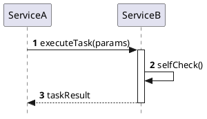
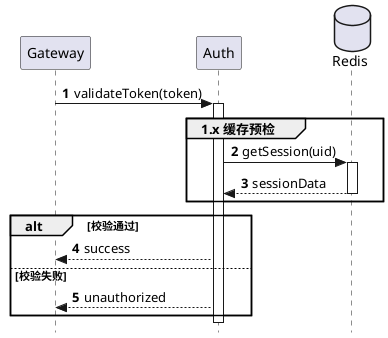
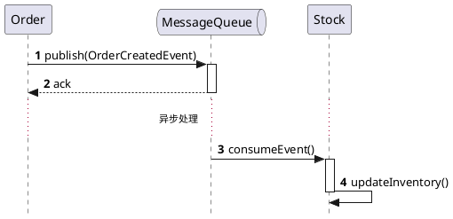

## Invoke When

Use this skill when any of the following is true:

- User asks for a PlantUML architecture diagram
- User asks to visualize system modules, services, or boundaries
- User asks for component diagrams, deployment views, or context/container diagrams
- User provides architecture text and wants it converted to PlantUML
- User asks to refactor an existing UML/Mermaid architecture diagram into PlantUML

## Core Principles

- Rigor First: Prohibit bare sequence diagrams without lifecycle management. All object interactions must reflect realistic resource allocation and release.
- Semantic Consistency: Operation steps must maintain hierarchical structure; flattening complex nested calls is strictly forbidden.
- Atomicity: Every `->` action must have a corresponding lifecycle initiation, and every return must correspond to termination.
- No Abbreviation: Unless the user explicitly requests a "minimal" version, all outputs must comply with production-grade documentation standards.

## Diagramming Specifications

### A. Structured Declaration

- Style Enforcement: The header must include `skinparam Style strictuml`.
- Clear Participants: Use standard elements such as `actor`, `participant`, `database`, `queue`, and `collections` according to semantic meaning.
- Automatic Numbering: Enable `autonumber` for logical traceability.

### B. Interaction Control

- Activation: Use `++` to activate and `return` or `--` to terminate.

- Call Depth: Multi-level nested calls must be clearly represented via indentation of activation blocks.

- Sub-process Handling:

  - Logical Decomposition: For scenarios where one request contains multiple sub-steps, use `group` tags (e.g., `group 2.x Validation Logic`).
  - Branching & Looping: Use `alt/else` for conditional branches and `loop` for iterative processes.

### C. Naming & Description

- Precise Labeling: Text on arrows must include: **[Method Name / Action] (Parameters / Core Content)**.

## 模板知识库

### 场景一：标准同步请求/响应 (Standard Sync)

> 用于描述典型的 Service-to-DB 或 API 调用。

### 场景二：复杂逻辑分组 (Complex Grouping)

> 用于描述包含校验、持久化、多级调用的业务。

### 场景三：异步/延迟处理 (Async Workflow)

> 用于描述消息队列或后台任务。

